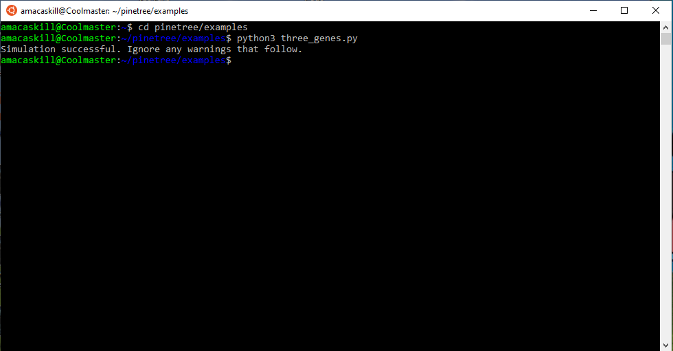
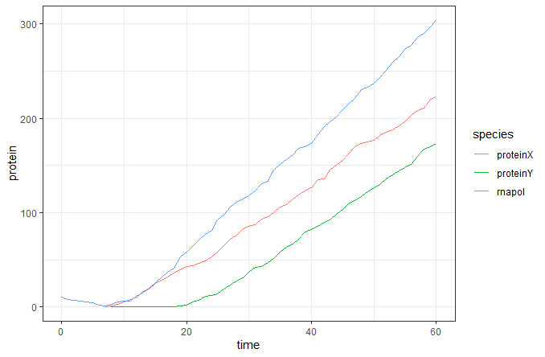

## Running a Toy Model in Pinetree
This tutorial aims to walk you through the procedure for runnning a pinetree simulation using a simplified genome.
1. Boot up your terminal (Terminal for Macs or Ubuntu for Windows)
2. Run the following command:
```sh
git clone https://github.com/clauswilke/pinetree.git
```
3. Set working directory to the examples folder using: 
```sh
cd pinetree/examples
```
4. Run the test script three_genes.py using:
```sh
python3 three_genes.py
```
5. The terminal should finish quickly, and look like this:


6. This script will create an output file named “three_genes_counts.tsv” in the same folder the script was run from.
   - For Windows users utilizing the ubuntu terminal, you will have to navigate to the Windows Subsystem for Linux network drive.
   - The easiest way to do this is to create a new desktop shortcut by right clicking on your desktop, choosing **New** and selecting **Shortcut** from the dropdown. Type in **\\\wsl$** into the box asking for the location of the item.
   - From this shortcut, navigate to **Ubuntu-20.04>home>your_username>pinetree>examples**
7. You can now access the data generated by your script! Next, we will look at an example of how to visualize this data.
## Visualizing Pinetree Data in R
Now that you've generated a dataset, lets try a simple example of how to display it.  
For this step, you will require some additional programs:
  - R, a programming language designed for data analysis. You can download R through one of the links [here.](https://cran.r-project.org/mirrors.html)
  - RStudio, an IDE that makes coding with R much more user-friendly. [Download Here](https://rstudio.com/products/rstudio/download/#download)
1. First, find the script **"time_course.R"** in this repository. It should be under **igem2020/T7-simulation/scripts** in your WSL network drive if you cloned from the ubuntu terminal.
   - This script creates a graph of the concentrations of various proteins during the course of a T7 bacteriophage infection. We will be adapting it for use in this toy model.
2. Open **"time_course.R"** using RStudio
3. On line 4, which reads `cts = read_tsv("example_output_phage_counts.tsv")`, replace **"example_output_phage_counts.tsv"** with **"three_genes_counts.tsv"**.
   - This line reads a tab sepereated value(.tsv) file of the given name into the script. Here we are changing the filename to that of the output file we created with `three_genes.py.`
4. Next, you will have to change line 6: `species.of.interest = c("gene 0.3", "rnapol-1", "rnapol-3.5", "gene 6", "gene 9")` to `species.of.interest = c("proteinX", "rnapol", "proteinY")`.
   - This line creates a vector that specifies which variables the script will search for, in our case: **proteinX**, **proteinY**, and **rnapol** are the only proteins created.
5. These changes will allow the script to graph protein concentration over time for `three_genes_counts.tsv`, but first we must set the working directory of RStudio to the folder containing the file of interest.
   -  For Windows users utilizing Ubuntu, use the path to the WSL network directory as such:
   ```r
   setwd("//wsl$/Ubuntu-20.04/home/username/pinetree/examples")
   ```
   - Remember to replace "username" with the username you created for Ubuntu.
6. After the directory is set, highlight all the lines of code and click "Run" at the top right of the editor box. This should take a few seconds and create a graph resembling this:

7. And you're done! This script can be utilized to visualize expression levels for other factors as well, including RNA transcript concentrations and ribosomal density. The line `to.graph="protein"` allows you to specify which factor you want to graph. Try changing the file back to **"example_output_phage_counts.tsv"** and playing around with the species of interest and factor to graph to see if you can find any interesting patterns!
   - Note, you will have to change the working directory to the folder containing **"example_output_phage_counts.tsv"** for this to work.
